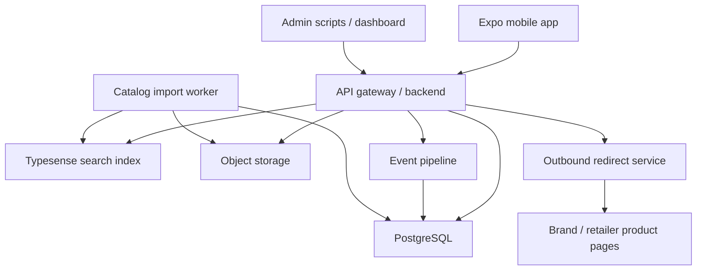

# Zoe Fashion Build And Ship Guide

**Source PRD:** `Zoe_Fashion_PRD.md`  
**Audience:** coding agents, product builders, designers, release owners  
**Last updated:** 2026-06-18  
**Goal:** provide a step-by-step system design, implementation plan, quality guardrails, and App Store / Google Play shipping checklist for Zoe.

---

## 1. Product North Star

Zoe is a mobile-first fashion discovery app that helps users discover and browse products across many brands in one place.

The app must prove two things:

1. Users can open Zoe and discover fashion products through a personalized, RedNote-like feed.
2. Users can intentionally browse, search, and filter products across brands with more precision than social media or a single retailer app.

Do not let the MVP drift into a generic social app, checkout marketplace, creator platform, or static link directory. Product browsing, search, catalog quality, and personalization are the core.

---

## 2. Non-Negotiable Product Rules

Every coding agent must follow these rules before adding features:

1. **Catalog is the source of truth.** Products are canonical catalog objects, not social posts.
2. **Discover and Browse are different surfaces.** Discover is passive and personalized. Browse/Search is active and precise.
3. **Filters must be real.** Do not fake filters with a tiny frontend array. Filters must query the backend database or search index.
4. **Product cards must come from data.** Do not hardcode product cards except as temporary seed fixtures behind an API.
5. **Every product detail page needs an outbound route.** Zoe v1 does not own checkout.
6. **Saves work everywhere.** Save state must work from Discover, Results, Detail, Brand, and Similar Items.
7. **User actions improve recommendations.** Views, searches, filters, saves, follows, and outbound clicks must be tracked.
8. **Brand diversity matters.** Discover must avoid showing only one brand unless the user explicitly chose a brand-specific context.
9. **Data quality is product quality.** Bad images, stale prices, broken URLs, and wrong categories must be flagged.
10. **Mobile polish is required.** Empty, loading, error, offline, and slow-network states are required for every user-facing surface.

---

## 3. Recommended Stack

Use the stack already suggested by the PRD unless the repository has a strong existing reason to do otherwise.

### Mobile

- Expo React Native
- TypeScript
- Expo Router
- TanStack Query for server cache
- Zustand for lightweight local UI state
- React Hook Form plus Zod for forms
- Expo SecureStore for local auth/session tokens
- EAS Build and EAS Submit for release builds

### Backend

- Node.js with TypeScript and Fastify, NestJS, or Express
- PostgreSQL
- Prisma migrations and client
- Typesense for MVP faceted search
- Redis later for feed/search caching
- S3-compatible storage for imported files and optional image proxy/cache
- Background workers for catalog ingestion and search indexing

### Auth

Recommended fastest path:

- Supabase Auth or Clerk for email, Apple, and Google auth
- Anonymous guest identity for browsing
- Required sign-in for saves and persistent collections

If using social login, support Apple Sign in wherever Apple requires it for equivalent third-party login options.

### Observability

- Structured logs
- Error reporting with Sentry or equivalent
- Product analytics with PostHog, Amplitude, Segment, or a minimal first-party event table
- Uptime monitoring for API and redirect endpoint

---

## 4. High-Level System Design



### Core runtime flow

1. Mobile app boots and fetches bootstrap config, auth state, style profile, and cached feed.
2. Discover tab requests `/api/discover/feed`.
3. Browse tab requests search facets and product results from `/api/search`.
4. Product detail requests product, offers, similar products, and save state.
5. Save/follow/search/filter/outbound events are written to `user_events`.
6. Feed generation uses profile, events, catalog quality, popularity, freshness, and diversity rules.
7. Catalog workers parse seed data or feeds, normalize products, flag quality issues, upsert database rows, then update Typesense.

---

## 5. Domain Model

Start from the PRD schema and add operational tables needed for production.

### Required PRD tables

- `users`
- `user_style_profiles`
- `brands`
- `categories`
- `product_groups`
- `product_variants`
- `retailers`
- `offers`
- `product_media`
- `saved_collections`
- `saved_items`
- `user_events`
- `brand_follows`
- `outbound_clicks`

### Add these production tables

- `import_runs`: one row per catalog import job.
- `raw_import_records`: raw source payloads for audit/debug.
- `catalog_quality_flags`: broken images, invalid URLs, impossible prices, missing fields, duplicates.
- `product_popularity_snapshots`: periodic aggregates for ranking and search.
- `search_index_jobs`: track indexing status and failures.
- `sessions`: optional server-side session/device tracking.
- `anonymous_id_links`: map anonymous guest activity to a user after signup.
- `account_deletion_requests`: store deletion status and audit timestamp.
- `consents`: privacy policy, terms, marketing, and analytics consent versions.
- `admin_audit_logs`: admin import/edit/merge actions.

### Modeling rules

- Use UUID primary keys.
- Use slugs for public brand/category routes.
- Store prices as numeric plus currency.
- Keep raw source data separate from normalized product data.
- Product images belong in `product_media`; `primary_image_url` is a denormalized shortcut.
- `offers` represent buyable listings and own outbound URLs.
- Never delete user event history required for analytics without honoring privacy/account deletion policy.

---

## 6. API Surface

Build REST first unless the repo has already committed to GraphQL.

### Auth and profile

- `POST /api/auth/signup`
- `POST /api/auth/login`
- `POST /api/auth/logout`
- `GET /api/me`
- `PATCH /api/me`
- `GET /api/me/style-profile`
- `PATCH /api/me/style-profile`
- `DELETE /api/me`

### Discover

- `GET /api/discover/feed?cursor=&limit=20`
- `POST /api/events`

### Search and browse

- `GET /api/search?q=&category=&brand=&priceMin=&priceMax=&size=&color=&availability=&sort=&cursor=&limit=40`
- `GET /api/search/autocomplete?q=`
- `GET /api/search/filters`

### Products

- `GET /api/products/:productId`
- `GET /api/products/:productId/similar`
- `GET /api/products/:productId/offers`

### Brands

- `GET /api/brands`
- `GET /api/brands/:slug`
- `GET /api/brands/:slug/products`
- `POST /api/brands/:brandId/follow`
- `DELETE /api/brands/:brandId/follow`

### Saved

- `GET /api/saved`
- `POST /api/saved`
- `DELETE /api/saved/:savedItemId`
- `GET /api/collections`
- `POST /api/collections`
- `PATCH /api/collections/:collectionId`
- `DELETE /api/collections/:collectionId`

### Outbound routing

- `GET /api/r/:offerId`
- `POST /api/outbound-clicks`

The redirect endpoint must log the click first, then choose `affiliate_url` if present, otherwise `product_url`, and then redirect.

### Admin/catalog

- `POST /api/admin/catalog/import`
- `GET /api/admin/catalog/import-runs`
- `GET /api/admin/products/flagged`
- `PATCH /api/admin/products/:productId`
- `POST /api/admin/products/:productId/merge`

Admin endpoints must require an admin role and must be unavailable to normal clients.

---

## 7. Build Order For Coding Agents

### Phase 0: Repository alignment

1. Identify current app entry points, backend entry points, and seed data.
2. Decide whether the current static prototype remains a reference or becomes deprecated.
3. Create one source-of-truth roadmap file from this guide.
4. Add or update `AGENTS.md` with the guardrails in section 14.
5. Add `.env.example` for mobile and backend.
6. Add CI commands for lint, typecheck, tests, and build.

Exit criteria:

- A new agent can run the app locally from documented commands.
- PRD path and guide path are clear.
- Existing user changes are not reverted.

### Phase 1: Mobile app shell

1. Use Expo React Native with TypeScript.
2. Set up Expo Router routes:
   - `/`
   - `/onboarding`
   - `/auth`
   - `/(tabs)/discover`
   - `/(tabs)/browse`
   - `/(tabs)/saved`
   - `/(tabs)/profile`
   - `/product/[id]`
   - `/brand/[slug]`
3. Add bottom tabs: Discover, Browse, Saved, Profile.
4. Add API client with typed request/response models.
5. Add TanStack Query provider and error boundary.
6. Add design tokens for color, spacing, type, shadows, and border radius.

Exit criteria:

- App boots on iOS simulator, Android emulator, and Expo web where practical.
- Empty route screens render without runtime errors.
- Network errors show user-friendly fallbacks.

### Phase 2: Backend foundation

1. Scaffold TypeScript backend.
2. Add request logging, error handling, CORS, rate limiting, and health check.
3. Add PostgreSQL and Prisma.
4. Add migrations for core schema.
5. Add Zod or equivalent validation for every request body/query.
6. Add integration test harness against a test database.

Exit criteria:

- `GET /health` works.
- Migrations run locally and in CI.
- Tests can create and tear down test data.

### Phase 3: Catalog foundation

1. Implement brands, categories, product groups, variants, offers, and media.
2. Create seed importer for JSON and CSV.
3. Create `import_runs`, `raw_import_records`, and `catalog_quality_flags`.
4. Add validation:
   - title required
   - brand required
   - image required
   - price required
   - product URL required
   - category required
   - currency required or defaulted safely
5. Add duplicate detection placeholder:
   - same source id
   - same brand plus normalized title plus color
   - same canonical product URL
6. Add flagged-products admin read endpoint or CLI command.

Exit criteria:

- At least 20 brands and 500 products import successfully.
- Invalid records are rejected or flagged with clear reasons.
- Product detail API returns complete normalized data.

### Phase 4: Search and filtering

1. Add Typesense collection and indexing job.
2. Index title, brand, category, subcategory, description, style tags, color, material, gender, price, sale price, availability, freshness, and popularity.
3. Implement `/api/search`.
4. Implement `/api/search/filters` from live facets.
5. Add sort options:
   - Recommended
   - Newest
   - Price low to high
   - Price high to low
   - Most saved
   - Sale percentage
6. Build Browse landing screen:
   - search bar
   - category shortcuts
   - brand shortcuts
   - trending searches
   - recent searches
7. Build Product Results screen:
   - 2-column grid
   - active filter chips
   - result count
   - sort button
   - filter sheet

Exit criteria:

- Filters combine correctly.
- Zero-results state suggests removing filters.
- Search supports typo tolerance and pagination.
- Results are not filtered only in frontend memory.

### Phase 5: Auth, onboarding, and guest mode

1. Implement guest mode with anonymous id.
2. Implement auth provider and session persistence.
3. Add Apple, Google, and email auth if required for MVP.
4. Build Welcome/Auth screen.
5. Build Interest Onboarding:
   - category chips
   - brand chips
   - style vibe chips
   - price preference
   - optional size profile
6. Persist `user_style_profiles`.
7. Link guest events to authenticated user after signup.

Exit criteria:

- Guest users can browse.
- Guest users are prompted to sign in when saving.
- Signed-in users keep auth state after restart.
- Onboarding selections seed Discover feed.

### Phase 6: Discover feed and personalization v1

1. Implement `/api/discover/feed`.
2. Score products using the PRD formula:
   - category match: 0.25
   - brand match: 0.20
   - style tag match: 0.20
   - popularity: 0.15
   - freshness: 0.10
   - price match: 0.05
   - availability: 0.05
3. Add diversity rules:
   - no more than 3 products from the same brand in a row
   - prefer valid images
   - prefer in-stock products
   - downrank products already seen many times
4. Build Discover feed UI with pull to refresh and pagination.
5. Track impressions, clicks, saves, product views, and outbound clicks.
6. Add optional reason labels.

Exit criteria:

- Feed loads in under 2 seconds with cached data.
- Personalization changes after saves/searches/views.
- Feed includes multiple brands unless explicitly scoped.

### Phase 7: Product detail and outbound routing

1. Build product detail page:
   - image carousel
   - brand
   - title
   - price and sale price
   - color variants
   - size availability
   - description
   - material/care
   - retailer/source
   - save/share buttons
   - outbound CTA
   - similar items
   - more from brand
2. Implement `/api/r/:offerId`.
3. Track outbound click before redirect.
4. Add link validation job for product URLs.
5. Show stale/out-of-stock status clearly.

Exit criteria:

- Every product detail has a working route out.
- Broken or missing outbound links are flagged.
- Affiliate URL takes priority when present.

### Phase 8: Saved collections and profile

1. Implement save API.
2. Implement default Wishlist collection.
3. Add collections CRUD.
4. Build Saved tab:
   - saved grid
   - collections list
   - create/edit collection
   - remove saved item
5. Build Profile:
   - identity
   - saved collections shortcut
   - followed brands
   - style interests
   - settings
   - account deletion entry point

Exit criteria:

- Save state is consistent across all surfaces.
- Collections persist across sessions.
- Account settings include deletion flow if accounts are supported.

### Phase 9: Brand pages

1. Implement brand API and follow API.
2. Build Brand Page:
   - logo/name
   - description
   - follow button
   - website link
   - category tabs
   - product grid
   - sort/filter controls
3. Feed followed-brand signals into Discover.

Exit criteria:

- Users can browse all products from a brand.
- Brand filters combine with category/price/size/color.
- Followed brands influence recommendations.

### Phase 10: Admin and operations

1. Add admin role.
2. Add import job dashboard or CLI.
3. Add flagged product view.
4. Add merge command for duplicates.
5. Add catalog quality metrics:
   - valid image rate
   - valid price rate
   - in-stock rate
   - broken outbound link rate
   - duplicate rate
   - zero-result search rate
6. Add scheduled jobs:
   - link check
   - image check
   - search reindex
   - feed popularity snapshot

Exit criteria:

- Catalog issues can be found and fixed without app redeploys.
- Import failures are visible and recoverable.

### Phase 11: Privacy, security, and compliance

1. Add privacy policy, terms, and support URL.
2. Implement account deletion if accounts exist.
3. Document data collection for Apple App Privacy and Google Data Safety.
4. Audit all SDKs for data collection and tracking behavior.
5. Add secure storage for tokens.
6. Add rate limiting on auth, search, event, and redirect endpoints.
7. Add input validation and output encoding.
8. Add dependency scanning.
9. Add role checks for admin routes.
10. Avoid logging secrets, tokens, raw auth headers, or sensitive profile data.

Exit criteria:

- App has privacy policy, support URL, deletion flow, and app-store data disclosures.
- Admin APIs are protected.
- Security tests pass.

### Phase 12: Release hardening

1. Add smoke tests for every critical route.
2. Add mobile e2e tests with Maestro or Detox:
   - onboarding
   - search/filter
   - product detail
   - save
   - outbound route
3. Add API integration tests.
4. Add performance checks:
   - Discover cached load under 2 seconds
   - Search p95 under 800 ms for MVP catalog
   - Product detail p95 under 600 ms
   - App cold start within acceptable Expo/native target
5. Add offline and poor-network tests.
6. Test on real iOS and Android devices.
7. Complete beta release through TestFlight and Play internal testing.

Exit criteria:

- No P0/P1 bugs.
- Critical user paths pass on iOS and Android physical devices.
- Store metadata and compliance answers are ready.

---

## 8. Design And Brand Workflow

The user mentioned Canva and Figma. Treat them as design and launch support tools, not as the product source of truth.

### Figma deliverables

- Mobile design system:
  - colors
  - typography
  - spacing
  - buttons
  - chips
  - product cards
  - bottom nav
  - filter sheet
  - modal patterns
- MVP screens:
  - Splash
  - Auth
  - Onboarding
  - Discover
  - Browse
  - Results
  - Filter Sheet
  - Product Detail
  - Brand Page
  - Saved
  - Profile
- States:
  - loading
  - empty
  - error
  - signed-out save prompt
  - offline

### Canva deliverables

- App Store screenshots
- Google Play screenshots
- Launch pitch deck
- Social launch graphics
- Brand one-pager for affiliate/retailer outreach

Design rule: Zoe should look like a premium fashion utility, not a busy social clone or generic database UI.

---

## 9. Search And Recommendation Details

### Search ranking v1

Use the PRD formula:

```text
search_score =
  text_relevance * 0.45
+ brand_match * 0.15
+ category_match * 0.15
+ popularity * 0.10
+ availability * 0.10
+ freshness * 0.05
```

### Discover ranking v1

Use the PRD formula:

```text
score =
  category_match_score * 0.25
+ brand_match_score * 0.20
+ style_tag_match_score * 0.20
+ popularity_score * 0.15
+ freshness_score * 0.10
+ price_match_score * 0.05
+ availability_score * 0.05
```

### Recommendation safeguards

- Filter out missing-image products.
- Downrank out-of-stock products.
- Downrank products seen repeatedly.
- Do not show more than 3 products from the same brand in a row.
- Include at least 3 brands in the first 20 feed items when catalog inventory allows.
- Add a fallback trending feed when user signals are sparse.
- Use deterministic pagination cursors so users do not see duplicated pages.

---

## 10. Data Ingestion Pipeline

Implement this exact pipeline:

```text
Raw source file/API
-> Parse
-> Validate
-> Normalize
-> Save raw import record
-> Upsert brand
-> Upsert category
-> Upsert product group
-> Upsert variants
-> Upsert offers
-> Save media
-> Flag quality issues
-> Index into search
```

### Required validation

Reject or flag:

- missing title
- missing brand
- missing image
- missing price
- missing product URL
- missing category
- invalid image URL
- invalid product URL
- missing currency
- duplicate source id
- impossible price

### Normalization rules

- Normalize brand names and slugs.
- Normalize category to Zoe taxonomy.
- Normalize color family to controlled values.
- Normalize size labels but preserve raw size in metadata.
- Normalize availability to `in_stock`, `out_of_stock`, `limited`, or `unknown`.
- Preserve raw input for debugging and future reprocessing.

---

## 11. Mobile UX Requirements

### Universal states

Every screen needs:

- skeleton or loading state
- empty state
- error state
- offline or retry state
- signed-out action state where relevant

### Visual rules

- Use product images as the visual anchor.
- Product cards must show image, brand, title, price, sale marker, and save button.
- Filter chips must be visible and individually removable.
- Price and availability must be clear before outbound click.
- Touch targets must be at least 44 x 44 points where feasible.
- Do not hide critical actions behind gestures only.

### Navigation rules

- Bottom tabs: Discover, Browse, Saved, Profile.
- Product detail opens from feed, results, brand page, and saved.
- Brand page opens from product detail, search, and feed cards.
- Back navigation must preserve current search/filter/feed position.

---

## 12. Analytics Plan

Track these events:

- `app_opened`
- `onboarding_completed`
- `discover_feed_loaded`
- `discover_product_impressed`
- `discover_product_clicked`
- `product_viewed`
- `product_saved`
- `product_unsaved`
- `product_clicked_out`
- `search_performed`
- `search_result_clicked`
- `filter_applied`
- `brand_viewed`
- `brand_followed`
- `collection_created`

Each event should include when available:

- user id
- anonymous id
- session id
- product id
- brand id
- category id
- query
- filters
- source surface
- timestamp

Analytics guardrail: only collect what is needed for product functionality, personalization, safety, attribution, and business metrics. Keep disclosures aligned with actual collection.

---

## 13. Quality Gates

### Required commands before completion

Each coding agent must run the closest available equivalents:

```bash
npm run lint
npm run typecheck
npm test
npm run test:e2e
npm run build
```

If a command does not exist, the agent must either add it when appropriate or state clearly that it is missing.

### Pull request acceptance

No PR is ready unless:

- Unit tests cover changed business logic.
- Integration tests cover changed API behavior.
- At least one e2e path covers changed critical UX.
- Database migrations have rollback or forward-fix instructions.
- API responses are typed and validated.
- Errors are handled without blank screens.
- Loading and empty states are included.
- No secrets are committed.
- Store/privacy implications are documented when SDKs or tracking change.

---

## 14. Coding Agent Guardrails

Use this section as the recommended `AGENTS.md` content.

### Mission

Build Zoe as a catalog-first fashion discovery and browse app. Optimize for correct data flow, product quality, search/filter precision, mobile polish, and store-shippable reliability.

### Before changing code

1. Read `Zoe_Fashion_PRD.md`.
2. Read this guide.
3. Inspect existing files before editing.
4. Check `git status --short`.
5. Identify whether the task touches mobile, backend, data, search, analytics, release, or docs.
6. Make a short implementation plan for multi-file or high-risk changes.

### Implementation rules

1. Keep changes scoped to the requested feature.
2. Prefer existing architecture and naming.
3. Use TypeScript types at API boundaries.
4. Validate all inputs with schemas.
5. Do not hardcode product data in UI components.
6. Do not fake backend filters in frontend-only code.
7. Do not add social, checkout, creator, or AI stylist features before MVP pillars work.
8. Do not store secrets in source code.
9. Do not log tokens, auth headers, or sensitive user data.
10. Do not introduce new dependencies without a clear reason.
11. Do not change store-facing data collection without updating privacy documentation.
12. Do not declare work complete without running verification commands.

### Data rules

1. Preserve raw import records.
2. Normalize products into canonical categories.
3. Flag bad records instead of silently dropping everything.
4. Prefer in-stock, valid-image products in feeds.
5. Keep affiliate URL, direct URL, and source URL fields separate.
6. Track source metadata for every imported product.

### UI rules

1. Build actual product surfaces first, not marketing pages.
2. Use product images prominently.
3. Include loading, empty, error, and offline states.
4. Preserve scroll position when returning from detail pages.
5. Make save state immediate and reconcile with the backend.
6. Keep Discover visually inspiring and Browse operationally precise.

### Testing rules

1. Add tests near changed code.
2. Test happy path, empty state, error state, and permission/auth state.
3. Test filters in combination, not only individually.
4. Test outbound click logging before redirect.
5. Test guest-to-auth transition for saved actions and event linking.

### Stop conditions

Stop and ask the user when:

- a required secret, account, or credential is missing
- a destructive migration would delete user/product data
- a legal/compliance decision is needed
- app store policy interpretation affects the business model
- the task conflicts with the PRD non-goals

### Definition of done

A feature is done only when:

- the user path works on mobile
- the backend contract is implemented and validated
- data persists where required
- analytics events are emitted
- tests pass
- loading, empty, and error states are handled
- docs or store disclosures are updated when affected

---

## 15. Security And Privacy Guardrails

### Account and identity

- Support guest browsing with anonymous id.
- Require login for saving, collections, and persistent profile.
- Provide account deletion from Profile/Settings if account creation exists.
- Delete or anonymize user data according to the privacy policy and store requirements.

### API security

- Validate all request bodies and query params.
- Rate limit auth, search, events, and redirect endpoints.
- Use parameterized database queries through Prisma.
- Enforce role-based access control for admin endpoints.
- Use HTTPS in production.
- Use signed or short-lived URLs where private storage is ever introduced.

### Mobile security

- Store tokens in SecureStore or platform keychain/keystore.
- Do not put secrets in mobile app config.
- Use environment-specific API base URLs.
- Disable verbose logging in production builds.
- Review third-party SDK data collection before release.

---

## 16. App Store And Google Play Shipping Plan

This section reflects source checks performed on 2026-06-18. Re-check before final submission because store rules change.

### Pre-release accounts

1. Enroll in Apple Developer Program.
2. Create App Store Connect app record.
3. Enroll in Google Play Console.
4. Create Play Console app record.
5. Configure app identifiers, bundle IDs, package names, signing, and team access.

### Required app configuration

1. Use stable bundle identifiers:
   - iOS example: `com.zoe.fashion`
   - Android example: `com.zoe.fashion`
2. Configure icons, splash screen, app name, version, and build number.
3. Configure deep links/universal links later if needed.
4. Configure associated domains only if required.
5. Ensure production API URLs are used in production builds.

### Expo/EAS release commands

Use EAS profiles similar to:

```bash
npm install -g eas-cli
eas login
eas build:configure
eas build --platform ios --profile production
eas build --platform android --profile production
eas submit --platform ios --profile production
eas submit --platform android --profile production
```

### Apple App Store checklist

1. Build with the currently required SDK/Xcode version.
2. Complete App Store Connect metadata:
   - name
   - subtitle
   - description
   - keywords
   - category
   - support URL
   - marketing URL if available
   - privacy policy URL
3. Upload screenshots for required device sizes.
4. Complete App Privacy details based on actual SDK/data use.
5. Complete age rating.
6. Complete export compliance.
7. Provide demo account if review needs login.
8. Ensure all links work, including support, privacy policy, product outbound links, and login flows.
9. If using third-party login such as Google, ensure Apple login is included where Apple requires equivalent Apple Sign in support.
10. Confirm outbound commerce is for physical goods routed to brand/retailer pages, not digital goods requiring Apple's in-app purchase.
11. Add account deletion flow if users can create accounts.
12. Submit to TestFlight first, then App Review.

### Google Play checklist

1. Build Android App Bundle (`.aab`), not only APK.
2. Target the currently required Android API level for new submissions.
3. Complete Play Console metadata:
   - app name
   - short description
   - full description
   - category
   - tags
   - screenshots
   - feature graphic
   - privacy policy URL
   - contact email
4. Complete Data Safety form based on actual collection/sharing.
5. Complete content rating.
6. Complete target audience and ads declarations.
7. Complete app access instructions and demo credentials if review needs login.
8. Add in-app and web account deletion path if accounts are supported.
9. Test through internal testing, closed testing if needed, then production.

### Store policy risks specific to Zoe

- **Outbound product links:** Keep the app useful before redirecting. It must offer discovery, search, filters, saves, and product details, not only a list of links.
- **Affiliate links:** Disclose affiliate or sponsored placements where required by law/policy.
- **User data:** Search history, saves, clicks, follows, and style profile data must be disclosed in privacy/data safety forms if collected.
- **Personalization:** Let users understand and control style preferences.
- **Stale products:** Broken or misleading product links create review and trust risk.
- **Third-party SDKs:** App privacy/data safety answers must match SDK behavior.

---

## 17. Launch Assets

### App Store screenshots

Show the actual app, not abstract marketing:

1. Discover feed with multiple brands.
2. Browse/Search with filters.
3. Product results grid.
4. Product detail with outbound CTA.
5. Saved collections.

### Google Play screenshots

Use the same core set, adjusted to required dimensions.

### Website/legal minimum

- Privacy policy
- Terms of service
- Support/contact page
- Account deletion page or instructions
- Affiliate disclosure if affiliate monetization is active

---

## 18. MVP Acceptance Checklist

The MVP is shippable when all items are true:

- User can open the app and complete onboarding.
- User can browse Discover feed.
- User can search fashion items.
- User can browse by category.
- User can browse by brand.
- User can filter by brand, category, price, color, size, and availability.
- User can open product detail.
- User can save products.
- User can view saved products.
- User can create and edit collections.
- User can open brand page.
- User can tap View at Brand/Retailer and be routed out.
- Outbound clicks are logged.
- Product views, searches, filters, and saves are tracked.
- Discover feed changes based on interests/actions.
- Catalog can be loaded from seed data.
- Search index can be rebuilt.
- Loading, empty, error, and offline states exist.
- Privacy policy, support URL, and account deletion flow exist.
- iOS and Android beta builds pass smoke tests on real devices.

---

## 19. Suggested First Ten Tickets

1. Add `AGENTS.md` with section 14 rules.
2. Convert backend to TypeScript or create a new TypeScript API package.
3. Add Prisma schema and migrations for catalog core tables.
4. Build seed importer with validation and quality flags.
5. Add product detail and brand APIs.
6. Add Typesense and search indexing.
7. Build Expo Router tab shell and typed API client.
8. Build Browse/Search landing, results grid, and filter sheet.
9. Build Discover feed endpoint and screen.
10. Build saved items and collections with auth/guest handling.

---

## 20. Source Links Checked

- Apple App Review Guidelines: https://developer.apple.com/app-store/review/guidelines/
- Apple App Store Connect Help: https://developer.apple.com/help/app-store-connect/
- Apple privacy manifest and required reason APIs: https://developer.apple.com/documentation/bundleresources/privacy_manifest_files
- Apple upcoming app submission requirements: https://developer.apple.com/news/upcoming-requirements/
- Google Play target API level requirements: https://developer.android.com/google/play/requirements/target-sdk
- Android App Bundle overview: https://developer.android.com/guide/app-bundle
- Google Play Data safety: https://support.google.com/googleplay/android-developer/answer/10787469
- Google Play account deletion policy: https://support.google.com/googleplay/android-developer/answer/13327111
- Expo EAS Build: https://docs.expo.dev/build/introduction/
- Expo EAS Submit: https://docs.expo.dev/submit/introduction/
- OWASP Mobile Application Security: https://mas.owasp.org/
- OWASP Application Security Verification Standard: https://owasp.org/www-project-application-security-verification-standard/
- OpenAI prompt engineering guide: https://platform.openai.com/docs/guides/prompt-engineering
- OpenAI Codex AGENTS.md guidance: https://developers.openai.com/codex/guides/agents-md
- OpenAI Codex best practices: https://developers.openai.com/codex/learn/best-practices
